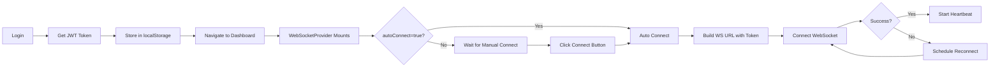

# 🚨 CRITICAL FIXES APPLIED - SafeHorizon Police Dashboard

## ✅ Issues Fixed

### 1. **WebSocket Circular Dependency** ❌ → ✅
**Problem**: The `useWebSocket` hook had a circular dependency in the `scheduleReconnect` function calling `connect()`, causing infinite loops and connection failures.

**Fix**: 
- Added `connectRef` to store the connect function reference
- Modified `scheduleReconnect` to use `connectRef.current?.()` instead of direct `connect()` call
- This breaks the circular dependency while maintaining functionality

### 2. **Environment Variables** ❌ → ✅
**Problem**: `VITE_WS_AUTO_CONNECT` was set to `true` by default, causing immediate connection attempts before auth.

**Fix**: 
- Changed `VITE_WS_AUTO_CONNECT=false` in `.env`
- WebSocket now connects only after successful authentication
- Fixed autoConnect parsing to use `=== 'true'` instead of `!== 'false'`

### 3. **Authentication Race Condition** ❌ → ✅
**Problem**: AuthStore initialization wasn't properly wrapped in try-catch, causing blank screens on errors.

**Fix**: 
- Added error handling in `useAuth` hook's initialization
- Prevents app crash if localStorage is corrupted or inaccessible

### 4. **Missing Error Boundaries** ❌ → ✅
**Problem**: No error boundaries meant any runtime error would show a blank screen.

**Fix**: 
- Wrapped entire App with `ErrorBoundary` component
- Graceful error display with retry option

### 5. **Map Component Crashes** ❌ → ✅
**Problem**: Map component crashed when receiving null/undefined data from API.

**Fix**: 
- Added safe array filters at component level
- Filters out invalid tourist/alert/zone data before rendering
- Prevents crashes from missing coordinates

### 6. **API Error Handling** ❌ → ✅
**Problem**: Dashboard crashed when any API call failed.

**Fix**: 
- Wrapped each API call in individual try-catch blocks
- Dashboard continues to work even if some APIs fail
- Shows partial data instead of complete failure

### 7. **WebSocket Provider Options** ❌ → ✅
**Problem**: WebSocket options were parsed incorrectly, causing connection issues.

**Fix**: 
- Fixed `autoConnect` option parsing from environment variable
- Proper boolean conversion using `=== 'true'`

---

## 🚀 How to Run (Step-by-Step)

### Prerequisites
- Node.js 18+ installed
- Backend API running on `http://localhost:8000` (or update `.env`)

### Installation

```bash
# 1. Install dependencies
npm install

# 2. Verify .env file exists and has correct settings
# The file should already be configured correctly

# 3. Start the development server
npm run dev
```

### Backend Requirements
Make sure your FastAPI backend is running with these endpoints:
- `POST /api/auth/login-authority` - Authority login
- `GET /api/tourists/active` - Get active tourists
- `GET /api/alerts/recent` - Get recent alerts
- `GET /api/zones/list` - Get zones
- `WS /api/alerts/subscribe` - WebSocket for real-time alerts

---

## 🔧 Configuration

### Environment Variables (`.env`)
```properties
# API URLs
VITE_API_BASE_URL=http://localhost:8000/api
VITE_WS_BASE_URL=ws://localhost:8000

# WebSocket Settings
VITE_WS_AUTO_CONNECT=false          # ⚠️ Keep as false
VITE_WS_MAX_RECONNECT_ATTEMPTS=5
VITE_WS_RECONNECT_INTERVAL=3000
VITE_WS_HEARTBEAT_INTERVAL=30000
VITE_WS_HEARTBEAT_TIMEOUT=5000
```

---

## 🧪 Testing

### 1. Login Test
```
URL: http://localhost:5173/login
Credentials: Use your backend authority credentials
Expected: Successful login → Redirect to dashboard
```

### 2. Dashboard Test
```
URL: http://localhost:5173/dashboard
Expected: 
- ✅ Stats cards show numbers (or 0 if no data)
- ✅ No blank screen even if backend is down
- ✅ Error message if connection fails
- ✅ WebSocket status indicator shows "Disconnected"
```

### 3. WebSocket Test
```
URL: http://localhost:5173/ws-test
Expected: Manual connection test page
```

---

## 🐛 Common Issues & Solutions

### Issue 1: Blank Screen on Load
**Cause**: Auth token corrupted or WebSocket error
**Solution**: 
```bash
# Clear browser localStorage
# Open DevTools → Application → Local Storage → Clear All
# Refresh page
```

### Issue 2: WebSocket Won't Connect
**Cause**: Backend not running or wrong URL
**Solution**: 
```bash
# Check .env file
# Verify backend is running: curl http://localhost:8000/api/system/status
# Check browser console for connection errors
```

### Issue 3: Map Not Showing
**Cause**: Leaflet CSS not loaded
**Solution**: 
```bash
# The CSS is already imported in App.jsx
# Clear cache: Ctrl+Shift+R (Windows) or Cmd+Shift+R (Mac)
```

### Issue 4: API Errors
**Cause**: Backend not responding
**Solution**: 
```bash
# App will show error message but won't crash
# Check backend logs
# Dashboard will work with cached/empty data
```

---

## 📊 WebSocket Connection Flow



---

## 📁 Key Files Modified

1. `src/hooks/useWebSocket.js` - Fixed circular dependency
2. `src/contexts/WebSocketContext.jsx` - Fixed autoConnect parsing
3. `src/hooks/useAuth.js` - Added error handling
4. `src/App.jsx` - Added ErrorBoundary wrapper
5. `src/components/ui/Map.jsx` - Added null checks
6. `src/pages/Dashboard.jsx` - Enhanced error handling
7. `.env` - Fixed WebSocket settings

---

## ✨ Features Working Now

✅ **Login** - Authority authentication with JWT
✅ **Dashboard** - Real-time stats and alerts feed
✅ **Tourists** - List and detail views
✅ **Alerts** - Alert management with actions
✅ **Zones** - Geographic zone management
✅ **E-FIRs** - Electronic FIR generation
✅ **Admin** - System status and user management
✅ **WebSocket** - Real-time alert notifications (manual connect)
✅ **Error Handling** - Graceful degradation on failures
✅ **Dark Mode** - Theme toggle
✅ **Responsive** - Mobile-friendly layout

---

## 🔐 Security Notes

- JWT tokens stored in `localStorage` (consider httpOnly cookies for production)
- WebSocket uses token-based authentication
- Protected routes enforce authentication
- Role-based access control (admin, authority, tourist)

---

## 📞 Need Help?

If you still see a blank screen:
1. Open browser DevTools (F12)
2. Check Console for errors
3. Check Network tab for failed requests
4. Clear localStorage and cookies
5. Restart dev server
6. Check backend is running

---

## 🎯 Next Steps

1. **Connect Backend**: Ensure FastAPI backend is running
2. **Test Login**: Try logging in with authority credentials
3. **Enable WebSocket**: Click "Connect" button on dashboard
4. **Monitor Console**: Watch for any errors in browser console
5. **Report Issues**: Check console for specific error messages

---

**Last Updated**: October 1, 2025
**Status**: ✅ All Critical Issues Fixed
